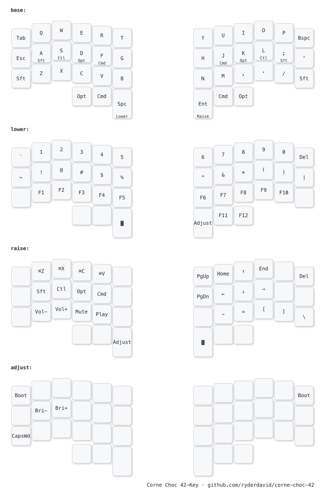

# Corne Choc 42-Key Layout Planner

Keymap designs and visualizations for a **Corne Choc** (3x6+3) split keyboard running QMK/Vial on an **RP2040 Pro Micro** controller.

## Hardware

| Property | Value |
|----------|-------|
| Board | Corne Choc (3x6+3) |
| Controller | RP2040 Pro Micro |
| Keys | 42 (21 per half) |
| Firmware | QMK with Vial support |
| OS Target | macOS |

## Layouts

### QWERTY

Standard QWERTY with SCAG home row mods (Shift-Ctrl-Alt/Opt-Gui/Cmd).



### Gallium v1

Alternative alpha layout optimized for comfort and efficiency on column-stagger boards, with SCAG home row mods adapted to Gallium positions.

```
b l d c v   j y o u ,
n r t s g   p h a e i
q x m w z   k f ' / .
```


## Layers

| Layer | Index | Purpose | Activation |
|-------|-------|---------|------------|
| Base | 0 | Alpha keys + home row mods | Default |
| Lower | 1 | Numbers, F-keys, symbols | Hold inner left thumb |
| Raise | 2 | Navigation, editing, media | Hold inner right thumb |
| Adjust | 3 | System, brightness, bootloader | Lower + Raise |

## Thumb Cluster

```
Left:   Opt  Cmd  Lower/Space
Right:  Raise/Enter  Cmd  Opt
```

macOS-optimized: Cmd in prime thumb positions, Opt on outer thumbs.

## Home Row Mods (SCAG)

| Finger | Left | Right |
|--------|------|-------|
| Pinky | Shift | Shift |
| Ring | Control | Control |
| Middle | Option | Option |
| Index | Command | Command |

## File Structure

```
├── corne.json                    # Physical layout (42-key column stagger)
├── keymap_drawer.config.yaml     # keymap-drawer styling config
├── layouts/
│   ├── qwerty/
│   │   ├── keymap.c              # QMK keymap source
│   │   └── vial-export.vil      # Vial export (after customizing)
│   └── gallium/
│       ├── keymap.c
│       └── vial-export.vil
├── keymap-drawer/                # Generated SVG/PNG visualizations
├── docs/
│   ├── layout.md                 # Position diagram
│   ├── ascii-template.txt       # ASCII render template
│   └── ascii-abbreviations.md   # Label abbreviation rules
└── scripts/
    └── draw.sh                   # Render all layouts
```

## Regenerate Visualizations

```bash
chmod +x scripts/draw.sh
./scripts/draw.sh
```

Requires [keymap-drawer](https://github.com/caksoylar/keymap-drawer) and `rsvg-convert`.

## Flash via Vial

1. Open [Vial](https://get.vial.today/) (web or desktop app)
2. Connect the keyboard via USB
3. Design your layout in the Vial GUI
4. Changes are applied in real-time (no compile/flash cycle needed)
5. Export your layout as a `.vil` file for backup

For bootloader mode (firmware updates): double-tap the reset button on the RP2040. It mounts as a USB drive — drag the `.uf2` firmware file onto it.
